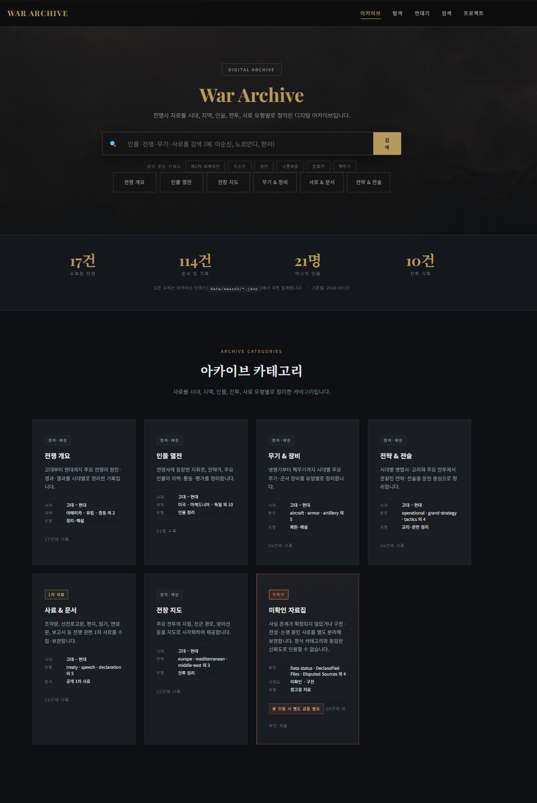
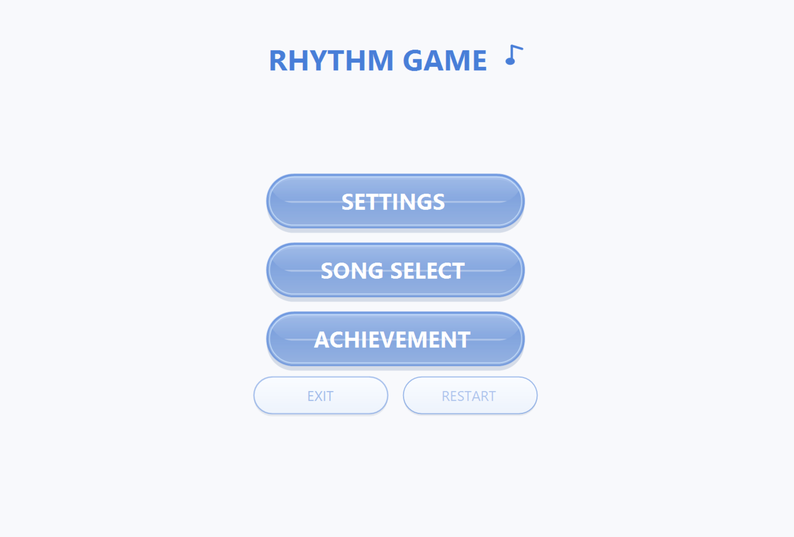
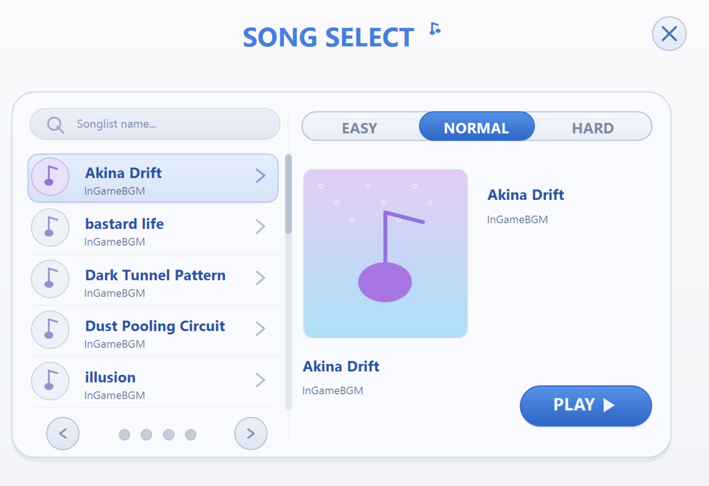
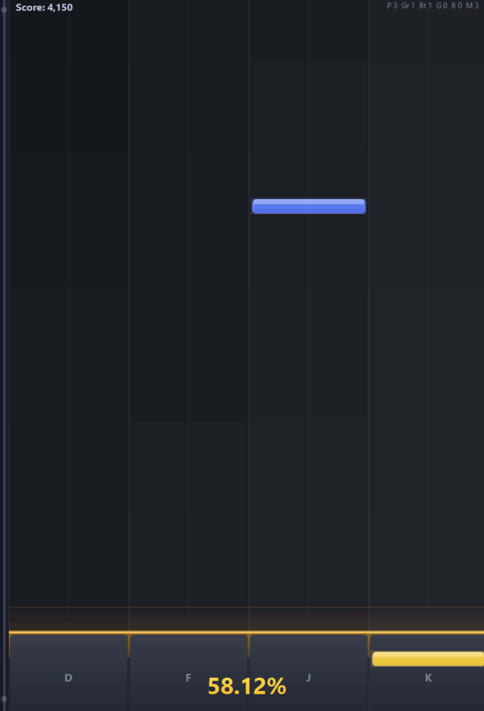

### 공개 저장소로 확인할 수 있는 개발 포트폴리오

아이디어를 실제로 동작하는 프로그램으로 만들고,  
완성 과정과 배운 점을 공개 저장소에 남기고 있습니다.

---

## Quick Links

| Category | Links |
|---|---|
| Main Projects | [War-Achive](https://github.com/kenitoa/War-Achive) · [local-ai](https://github.com/kenitoa/local-ai) · [MuWorld](https://github.com/kenitoa/MuWorld) |
| Game / Unity | [gameProject](https://github.com/kenitoa/gameProject) · [Unity-Scripts](https://github.com/kenitoa/Unity-Scripts) · [-3D-](https://github.com/kenitoa/-3D-) |
| Study / Logic | [mini-project](https://github.com/kenitoa/mini-project) |
| Live Preview | [War Archive Live Site](https://war-archive.tail498403.ts.net/) |

---

## Public Repository Updates

2026-05-25 기준, GitHub에 공개된 저장소만 반영했습니다.  
비공개 저장소나 로컬에만 있는 작업은 이 README의 프로젝트 현황과 언어 통계에서 제외했습니다.

| Repository | Changed Point | Link |
|---|---|---|
| War-Achive | 전쟁사 아카이브 프로젝트를 대표 웹 프로젝트로 정리하고, 공개 사이트 링크를 전면에 배치했습니다. | [Repo](https://github.com/kenitoa/War-Achive) · [Live](https://war-archive.tail498403.ts.net/) |
| local-ai | 기존 README에 빠져 있던 로컬 AI 데스크톱 시스템을 공개 포트폴리오에 추가했습니다. | [Repo](https://github.com/kenitoa/local-ai) |
| MuWorld | 리듬 게임 프로젝트를 대표 데스크톱 게임 프로젝트로 유지하고, 실제 화면 이미지를 함께 노출했습니다. | [Repo](https://github.com/kenitoa/MuWorld) |
| gameProject | Unity/C# 게임 제작 실험 저장소를 별도 프로젝트 항목으로 정리했습니다. | [Repo](https://github.com/kenitoa/gameProject) |
| Unity-Scripts | Unity에서 재사용할 스크립트 모음 저장소를 보조 포트폴리오로 분리했습니다. | [Repo](https://github.com/kenitoa/Unity-Scripts) |
| -3D- | 한신대학교 건물/공간 정보를 다루는 3D 웹 실험 저장소로 설명을 구체화했습니다. | [Repo](https://github.com/kenitoa/-3D-) |
| mini-project | 알고리즘과 로직 연습 저장소를 학습 기록 영역으로 정리했습니다. | [Repo](https://github.com/kenitoa/mini-project) |

---

## Portfolio At A Glance

| Project | Type | Main Tech | What To Check First |
|---|---|---|---|
| [War-Achive](https://github.com/kenitoa/War-Achive) | Full-stack Web Archive | HTML, CSS, JavaScript, Node.js, Express, MySQL | 전쟁사 데이터를 검색하고 탐색하는 공개 웹 아카이브 |
| [local-ai](https://github.com/kenitoa/local-ai) | Local AI Desktop System | C, C#, JavaScript, PowerShell, CSS | Windows PC에서 로컬 AI 채팅과 모델 실행을 다루는 시스템 |
| [MuWorld](https://github.com/kenitoa/MuWorld) | Desktop Rhythm Game | C#, .NET, WinForms, GDI+, BMS | WAV 분석, 자동 채보, 판정, 렌더링을 직접 구현한 리듬 게임 |
| [gameProject](https://github.com/kenitoa/gameProject) | Unity Game Prototype | Unity, C#, ShaderLab, HLSL | 게임 시스템을 버전 단위로 실험하는 Unity 프로젝트 |
| [Unity-Scripts](https://github.com/kenitoa/Unity-Scripts) | Unity Script Archive | Unity, C# | 게임 제작에 반복적으로 쓰는 스크립트를 모으는 저장소 |
| [-3D-](https://github.com/kenitoa/-3D-) | 3D Web / Campus Info | JavaScript, TypeScript, HTML | 한신대학교 건물과 내부 층 정보를 보여주는 3D 실험 |
| [mini-project](https://github.com/kenitoa/mini-project) | Logic Practice | Python | 알고리즘과 작은 로직 구현을 누적하는 학습 저장소 |

---

## Featured Public Projects

<table>
<tr>
<td width="50%" valign="top">

### War-Achive

전쟁 역사 데이터를 체계적으로 정리하고 탐색할 수 있도록 만든 웹 아카이브 프로젝트입니다.  
전쟁, 인물, 전략, 사료, 전장, 무기 데이터를 JSON 기반으로 관리하고 검색 가능한 형태로 제공합니다.

<b>Focus</b>

- 전쟁사 데이터를 카테고리별로 구조화
- 검색과 필터링이 가능한 웹 아카이브 구성
- Node.js + Express 기반 API 흐름 정리
- MySQL, Docker, NAS 배포 흐름 실험

</td>
<td width="50%" valign="top">

### local-ai

Windows PC에서 로컬 AI 채팅과 모델 실행을 다루는 데스크톱형 AI 시스템입니다.  
로컬 환경에서 모델 실행, 웹 UI, 실행 스크립트, API 흐름을 연결하는 방향으로 구성했습니다.

<b>Focus</b>

- Windows PC 기반 로컬 AI 실행 환경
- 웹 UI와 로컬 모델 실행 흐름 연결
- PowerShell 실행 스크립트와 런처 구성
- C/C#, JavaScript, CSS가 함께 쓰이는 혼합 구조

 

### MuWorld

C# WinForms 기반 리듬 게임 프로젝트입니다.  
WAV 파일을 분석해 비트를 감지하고, 채보를 생성한 뒤 BMS 형식으로 저장 및 로드할 수 있도록 구현했습니다.

 

 

<b>Focus</b>

- 4-key 리듬 게임 플레이
- WAV 오디오 분석 기반 비트 감지
- BMS 포맷 저장 및 로드
- 시간 차이 기반 판정 시스템
- GDI+ 기반 직접 렌더링

</td>
</tr>
</table>

---

## Game / Unity Repositories

<table>
<tr>
<td width="33.3%" valign="top">

### gameProject

Unity와 C#으로 게임 시스템을 실험하는 공개 저장소입니다.  
플레이어, 환경, 상호작용, 버전 단위 기능 확장을 중심으로 정리합니다.

<b>Focus</b>

- Unity 기반 게임 구조 연습
- C# 컴포넌트 설계
- ShaderLab / HLSL 실험
- 버전 단위 기능 확장

</td>
<td width="33.3%" valign="top">

### Unity-Scripts

Unity에서 반복적으로 필요한 스크립트를 모으는 저장소입니다.  
게임 오브젝트 제어, 상호작용, 사운드, 플레이어 동작처럼 재사용 가능한 기능 단위를 분리해 관리합니다.

<b>Focus</b>

- Unity C# 스크립트 정리
- 재사용 가능한 컴포넌트화
- Inspector 기반 파라미터 조정
- 게임 기능 단위 분리

</td>
<td width="33.3%" valign="top">

### -3D-

한신대학교 건물과 내부 층 정보를 보여주는 3D/웹 실험 저장소입니다.  
공간 정보, 장면 구성, 오브젝트 탐색 흐름을 웹 환경에서 다루는 데 초점을 둡니다.

<b>Focus</b>

- 3D 공간 구성
- 건물/층 정보 표현
- JavaScript / TypeScript 기반 웹 구현
- 카메라와 공간 탐색 흐름

</td>
</tr>
</table>

---

## Study Repository

### mini-project

알고리즘과 로직 구현을 연습하는 공개 저장소입니다.  
하나의 큰 결과물보다 다양한 문제를 작게 구현하고, 풀이 방식과 실험 기록을 남기는 데 초점을 둡니다.

<b>Focus</b>

- Python 기반 로직 구현
- 알고리즘 사고 훈련
- 작은 프로그램 설계
- 학습 기록 누적

---

## Tech Stack

### Languages

### Frameworks / Tools

---

## Profile

| Item | Detail |
|---|---|
| Name | 김동민 |
| School | 한신대학교 |
| Major | 컴퓨터공학부 |
| GitHub | [github.com/kenitoa](https://github.com/kenitoa) |
| Email | [kiseno3231@gmail.com](mailto:kiseno3231@gmail.com) |

---

## Development Style

<table>
<tr>
<td align="center" width="25%">
<b>Plan</b>
 
기능을 작게 나누고 우선순위를 잡습니다.
</td>
<td align="center" width="25%">
<b>Build</b>
 
직접 구현하며 실행 가능한 형태로 만듭니다.
</td>
<td align="center" width="25%">
<b>Refine</b>
 
사용성, 구조, 데이터 흐름을 개선합니다.
</td>
<td align="center" width="25%">
<b>Document</b>
 
배운 점과 현재 상태를 README에 남깁니다.
</td>
</tr>
</table>

---

### Thanks for visiting my public portfolio.

