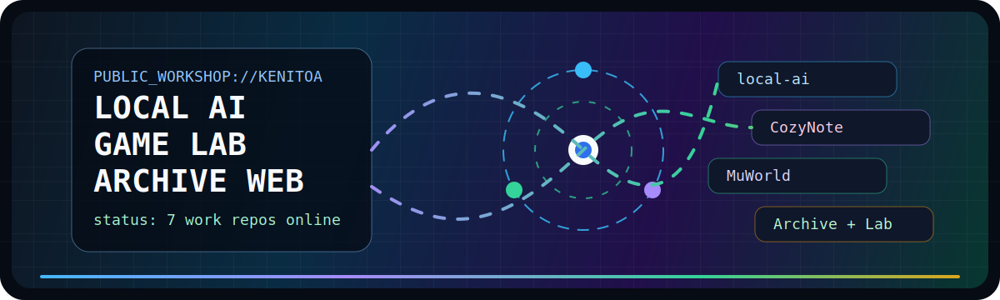
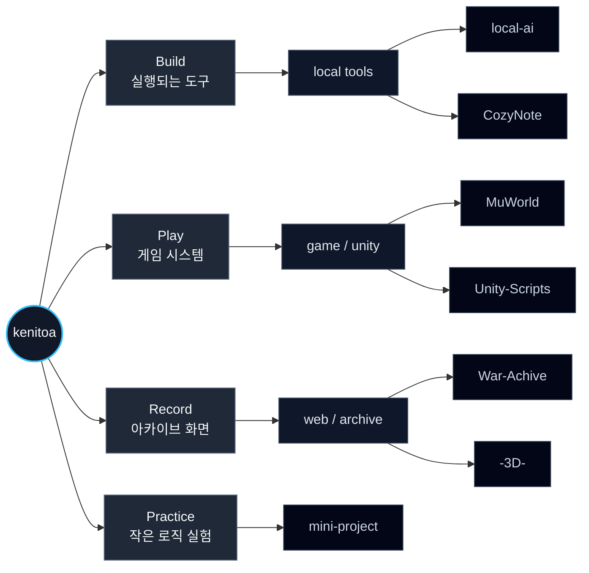
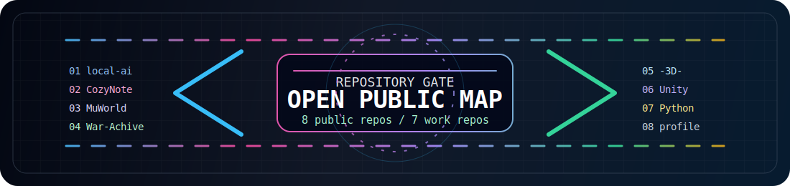

<p align="center">
  
</p>

<table>
  <tr>
    <td width="66%" valign="top">
      <h1>KENITOA PUBLIC WORKSHOP</h1>
      <p>
        로컬 AI, 게임 시스템, 아카이브 웹, 메모 앱, 작은 로직 실험을 한곳에 모아두는 공개 작업실입니다.
      </p>
      <pre>
+--------------------------------------------------------------+
| BOOT TARGET : kenitoa                                        |
| MODE        : local-first tools / game lab / archive web     |
| PUBLIC MAP  : 7 work repositories + 1 profile repository     |
+--------------------------------------------------------------+
| local-ai      -> Windows desktop local AI runtime            |
| CozyNote      -> memo app + lo-fi music + mini game          |
| MuWorld       -> C# rhythm game                              |
| War-Achive    -> structured war history archive              |
| -3D-          -> campus/building information web             |
| Unity-Scripts -> reusable Unity script shelf                 |
| mini-project  -> Python logic experiments                    |
+--------------------------------------------------------------+
      </pre>
    </td>
    <td width="34%" valign="top">
      <h3>Quick Jump</h3>
      <p><a href="#01-main-systems">01 Main Systems</a></p>
      <p><a href="#02-screenshot-dock">02 Screenshot Dock</a></p>
      <p><a href="#03-lab-shelf">03 Lab Shelf</a></p>
      <p><a href="#04-signal-map">04 Signal Map</a></p>
      <p><a href="https://github.com/kenitoa?tab=repositories">All Public Repositories</a></p>
      <hr>
      <h3>Current Public Scope</h3>
      <p><strong>8</strong> public repositories</p>
      <p><strong>7</strong> public work repositories highlighted here</p>
    </td>
  </tr>
</table>

<p align="center">
  
  
  
  
  
</p>

<table>
  <tr>
    <td align="center"><kbd>LOCAL AI</kbd></td>
    <td align="center"><kbd>COZY NOTE</kbd></td>
    <td align="center"><kbd>GAME SYSTEMS</kbd></td>
    <td align="center"><kbd>ARCHIVE WEB</kbd></td>
    <td align="center"><kbd>UNITY SCRIPTS</kbd></td>
    <td align="center"><kbd>PYTHON LOGIC</kbd></td>
  </tr>
</table>

## 01 Main Systems

```text
COLOR ROUTE  ::  cyan -> rose -> violet -> green -> amber
MOTION LAYER ::  ./assets/workshop-motion.svg
PHOTO POLICY ::  screenshot slots are marked as "(사진 추가)"
```

<table>
  <tr>
    <td width="50%" valign="top">
      <h2><a href="https://github.com/kenitoa/local-ai">local-ai</a></h2>
      <p><strong>Windows PC 안에서 실행되는 로컬 AI 데스크톱 시스템</strong></p>
      <p>로컬 채팅, 모델 실행, 모델 관리, Cloud AI Interface 방식의 실행 흐름을 다루는 프로젝트입니다.</p>
      <pre>INPUT -> ROUTER -> MODEL RUNTIME -> RESPONSE</pre>
      <p><code>C</code> <code>C#</code> <code>JavaScript</code> <code>PowerShell</code> <code>HTML/CSS</code></p>
    </td>
    <td width="50%" valign="top">
      <h2><a href="https://github.com/kenitoa/CozyNote">CozyNote</a></h2>
      <p><strong>메모장, lo-fi 음악, 미니 게임을 묶은 감성형 데스크톱 앱</strong></p>
      <p>메모 작성 흐름에 음악과 작은 게임 요소를 함께 배치한 공개 프로젝트입니다.</p>
      <pre>MEMO -> LO-FI MUSIC -> MINI GAME -> COZY LOOP</pre>
      <p><code>Java</code> <code>CSS</code> <code>PowerShell</code></p>
    </td>
  </tr>
  <tr>
    <td width="50%" valign="top">
      <h2><a href="https://github.com/kenitoa/MuWorld">MuWorld</a></h2>
      <p><strong>AI 생성 이미지와 수록곡을 활용한 C# 리듬게임</strong></p>
      <p>게임플레이 구조, 판정 흐름, 로컬 검증을 함께 정리하는 게임 프로젝트입니다.</p>
      <pre>CHART -> NOTE FLOW -> JUDGMENT -> SCORE</pre>
      <p><code>C#</code> <code>C</code> <code>Batchfile</code></p>
    </td>
    <td width="50%" valign="top">
      <h2><a href="https://github.com/kenitoa/War-Achive">War-Achive</a></h2>
      <p><strong>전쟁사 정보를 구조화해서 기록하는 아카이브 웹</strong></p>
      <p>역사 정보와 구전 자료를 JSON 기반 기록으로 축적하는 공개 웹 프로젝트입니다.</p>
      <pre>RECORD -> JSON DATA -> ARCHIVE PAGE</pre>
      <p><code>Archive</code> <code>Website</code> <code>JSON data</code></p>
    </td>
  </tr>
  <tr>
    <td width="50%" valign="top">
      <h2><a href="https://github.com/kenitoa/-3D-">-3D-</a></h2>
      <p><strong>한신대학교 건물과 내부 층 정보를 보여주는 3D 스타일 페이지</strong></p>
      <p>캠퍼스 공간 정보를 웹에서 탐색할 수 있도록 구성한 정보형 프로젝트입니다.</p>
      <pre>BUILDING -> FLOOR INFO -> WEB VIEW</pre>
      <p><code>JavaScript</code> <code>TypeScript</code> <code>HTML</code></p>
    </td>
    <td width="50%" valign="top">
      <h2>Next Capture Slot</h2>
      <p><strong>추후 대표 화면을 추가할 공간입니다.</strong></p>
      <p>원하는 스크린샷을 찍은 뒤 이 영역의 자리표시자를 실제 이미지로 교체하면 됩니다.</p>
      <pre>(사진 추가)</pre>
      <p><code>screenshot</code> <code>preview</code> <code>placeholder</code></p>
    </td>
  </tr>
</table>

## 02 Screenshot Dock

<table>
  <tr>
    <td width="33%" align="center" valign="top">
      <h3>CozyNote</h3>
      <pre>(사진 추가)</pre>
      <p><sub>메모장 + lo-fi 음악 + 미니 게임 화면</sub></p>
    </td>
    <td width="33%" align="center" valign="top">
      <h3>local-ai</h3>
      <pre>(사진 추가)</pre>
      <p><sub>로컬 AI 데스크톱 실행 화면</sub></p>
    </td>
    <td width="33%" align="center" valign="top">
      <h3>MuWorld</h3>
      <pre>(사진 추가)</pre>
      <p><sub>리듬게임 플레이 화면</sub></p>
    </td>
  </tr>
  <tr>
    <td width="33%" align="center" valign="top">
      <h3>War-Achive</h3>
      <pre>(사진 추가)</pre>
      <p><sub>아카이브 웹 화면</sub></p>
    </td>
    <td width="33%" align="center" valign="top">
      <h3>-3D-</h3>
      <pre>(사진 추가)</pre>
      <p><sub>캠퍼스 정보 페이지 화면</sub></p>
    </td>
    <td width="33%" align="center" valign="top">
      <h3>Project Detail</h3>
      <pre>(사진 추가)</pre>
      <p><sub>추가로 보여주고 싶은 대표 장면</sub></p>
    </td>
  </tr>
</table>

## 03 Lab Shelf

<table>
  <tr>
    <td width="50%" valign="top">
      <h3><a href="https://github.com/kenitoa/Unity-Scripts">Unity-Scripts</a></h3>
      <p>게임 제작에 필요한 Unity 스크립트를 정리한 저장소입니다.</p>
      <p><kbd>Unity</kbd> <kbd>C#</kbd> <kbd>script shelf</kbd></p>
    </td>
    <td width="50%" valign="top">
      <h3><a href="https://github.com/kenitoa/mini-project">mini-project</a></h3>
      <p>알고리즘, 로직 구현, 프로그램 구조화, 문제 해결 연습을 위한 Python 미니 프로젝트 모음입니다.</p>
      <p><kbd>Python</kbd> <kbd>logic</kbd> <kbd>practice</kbd></p>
    </td>
  </tr>
</table>

## 04 Signal Map




<p align="center">
  <a href="https://github.com/kenitoa?tab=repositories">
    
  </a>
</p>

<p align="center">
  <sub>click the gate to open every public repository</sub>
</p>
