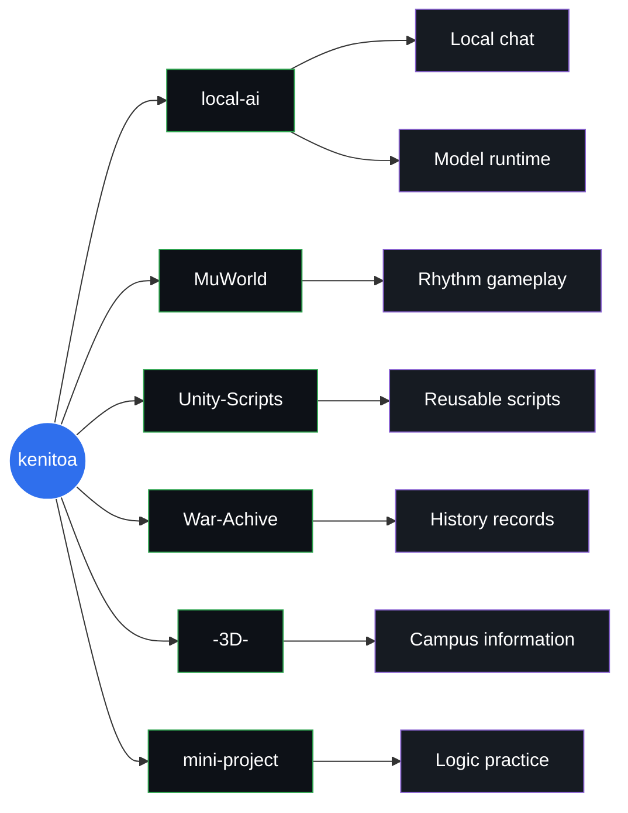

  

  로컬 AI, Unity/게임 프로젝트, 아카이브 웹, 작은 로직 실험을 만드는 개발 작업실입니다.

  
  
  
  

  <a href="#featured-work">Featured Work</a>
  &nbsp;|&nbsp;
  <a href="#project-library">Project Library</a>
  &nbsp;|&nbsp;
  <a href="#repository-map">Repository Map</a>
  &nbsp;|&nbsp;
  <a href="https://github.com/kenitoa?tab=repositories">All Repositories</a>

---

## Control Deck

<table>
  <tr>
    <td width="33%" align="center">
      MODE 
      <strong>Local-first Builder</strong>  
      <kbd>Windows</kbd> <kbd>Desktop</kbd> <kbd>AI Runtime</kbd>
    </td>
    <td width="33%" align="center">
      LAB 
      <strong>Game Systems</strong>  
      <kbd>Unity</kbd> <kbd>C#</kbd> <kbd>Rhythm</kbd>
    </td>
    <td width="33%" align="center">
      ARCHIVE 
      <strong>Structured Web</strong>  
      <kbd>History</kbd> <kbd>JSON</kbd> <kbd>3D Web</kbd>
    </td>
  </tr>
</table>

## Profile

로컬에서 직접 실행되는 도구, 게임 시스템, 공개 웹 프로젝트를 중심으로 작업합니다. 
아래 저장소들은 현재 이 GitHub 프로필에서 공개로 확인되는 작업 공간입니다.

## Project Constellation

## Featured Work

<table>
  <tr>
    <td width="50%" valign="top">
      <h3><a href="https://github.com/kenitoa/local-ai">local-ai</a></h3>
      
Windows PC에서 실행되는 로컬 AI 데스크톱 시스템입니다. 로컬 채팅, 모델 실행, 모델 관리, Cloud AI Interface 방식의 오케스트레이션을 다룹니다.

      
<code>C</code> <code>C#</code> <code>JavaScript</code> <code>PowerShell</code> <code>HTML/CSS</code>

    </td>
    <td width="50%" valign="top">
      <h3><a href="https://github.com/kenitoa/MuWorld">MuWorld</a></h3>
      
AI로 생성한 이미지와 수록곡을 활용한 C# 리듬게임 프로젝트입니다. 게임플레이 구조와 로컬 검증 흐름을 함께 정리하고 있습니다.

      
<code>C#</code> <code>C</code> <code>Batchfile</code>

    </td>
  </tr>
  <tr>
    <td width="50%" valign="top">
      <h3><a href="https://github.com/kenitoa/War-Achive">War-Achive</a></h3>
      
전쟁사 정보를 구조화해서 기록하는 아카이브 웹 프로젝트입니다. JSON 형식의 기록을 기반으로 역사 정보와 구전 자료를 축적하는 방향입니다.

      
<code>Archive</code> <code>Website</code> <code>JSON data</code>

    </td>
    <td width="50%" valign="top">
      <h3><a href="https://github.com/kenitoa/-3D-">-3D-</a></h3>
      
한신대학교 건물과 내부 층 정보를 보여주는 3D 스타일 정보 페이지입니다. 캠퍼스 공간 정보를 웹에서 탐색할 수 있게 구성합니다.

      
<code>JavaScript</code> <code>TypeScript</code> <code>HTML</code>

    </td>
  </tr>
</table>

---

## Project Library

| Repository | What it is | Main area |
| --- | --- | --- |
| [Unity-Scripts](https://github.com/kenitoa/Unity-Scripts) | 게임 제작에 필요한 Unity 스크립트를 정리한 저장소입니다. | Unity / C# |
| [mini-project](https://github.com/kenitoa/mini-project) | 알고리즘, 로직 구현, 프로그램 구조화, 문제 해결 연습을 위한 Python 미니 프로젝트 모음입니다. | Python / logic |

---

## Repository Map

| Area | Public repositories |
| --- | --- |
| 로컬 AI / 데스크톱 런타임 | [local-ai](https://github.com/kenitoa/local-ai) |
| 게임 / Unity | [MuWorld](https://github.com/kenitoa/MuWorld), [Unity-Scripts](https://github.com/kenitoa/Unity-Scripts) |
| 웹 / 아카이브 | [War-Achive](https://github.com/kenitoa/War-Achive), [-3D-](https://github.com/kenitoa/-3D-) |
| 학습 / 실험 | [mini-project](https://github.com/kenitoa/mini-project) |

## Current Public Repositories

현재 공개 저장소는 프로필 저장소를 포함해 7개입니다. 
위 프로젝트 섹션에서는 프로필 저장소를 제외한 6개의 공개 작업 저장소만 소개합니다.

  <a href="https://github.com/kenitoa?tab=repositories">Browse all public repositories</a>

  

