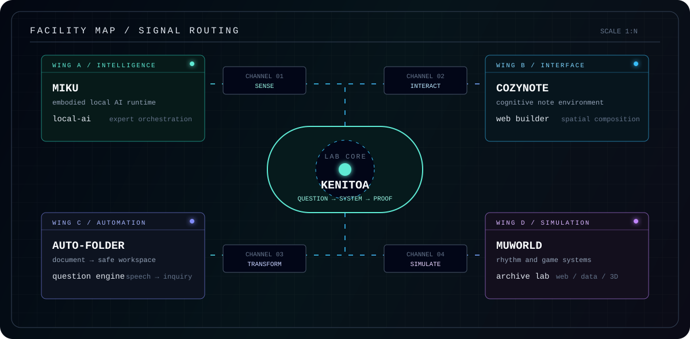
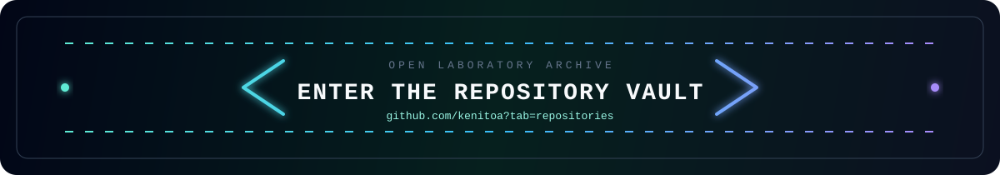

<p align="center">
  
</p>

<p align="center">
  <code>LOCAL INTELLIGENCE</code>&nbsp;&nbsp;·&nbsp;&nbsp;
  <code>HUMAN INTERFACE</code>&nbsp;&nbsp;·&nbsp;&nbsp;
  <code>PERSONAL AUTOMATION</code>&nbsp;&nbsp;·&nbsp;&nbsp;
  <code>PLAYABLE SYSTEMS</code>
</p>

<br>

```text
LABORATORY NOTE / KENITOA
──────────────────────────────────────────────────────────────────────────────
연구 질문     소프트웨어가 단순한 도구를 넘어, 보고 듣고 판단하고 반응할 수 있을까?
연구 방식     작은 아이디어를 실제 입력과 출력이 존재하는 완전한 시스템으로 만든다.
실험 환경     Windows · Local-first · Desktop · AI · Automation
완료 기준     실행됨이 아니라, 사용 흐름과 실패 경로가 함께 검증됨.
──────────────────────────────────────────────────────────────────────────────
```

> **이곳은 완성품 진열장이 아니라 시스템 연구실입니다.**<br>
> 각 저장소는 하나의 가설에서 출발해, 사용자에게 닿는 인터페이스와 검증 가능한 실행 흐름으로 발전합니다.

<br>

## `00 / PRIMARY RESEARCH`

<h3 align="center">EXP–α01 · MIKU VIRTUAL AI</h3>
<p align="center"><strong>감각 입력과 기억, 언어, 음성, 움직임을 하나의 로컬 존재로 연결하는 실험</strong></p>

```text
┌─ OBSERVE ─────────┐   ┌─ REASON ─────────────────┐   ┌─ EXPRESS ───────────┐
│ camera · microphone│──▶│ STT · memory · RAG · LLM │──▶│ TTS · face · motion │
└────────────────────┘   └───────────────────────────┘   └─────────────────────┘
           ▲                         │                              │
           └─────────────────────────┴──── continuous feedback ─────┘
```

**Abstract.** [Miku](https://github.com/kenitoa/Miku)는 화면 위의 Live2D 캐릭터가 사용자를 보고 듣고, 대화 맥락을 구성하고, 로컬 LLM으로 판단한 뒤 음성·표정·모션으로 응답하도록 만든 버추얼 AI 작업공간입니다. 카메라와 마이크, FunASR, pre-RAG, Ollama, post-RAG, GPT-SoVITS, Live2D를 분리된 책임 영역으로 설계하고 하나의 실시간 대화 런타임으로 연결합니다.

`APPARATUS`　Live2D / Electron / FunASR / RAG / Ollama / GPT-SoVITS<br>
`SIGNAL`　　　speech detection → context composition → local inference → embodied response<br>
`EVIDENCE`　　로컬 기능 gate, 실제 장치 입력, 지연 측정, 실패 시 CPU fallback 기록<br>
`ENTRY`　　　 [실험 저장소 열기 →](https://github.com/kenitoa/Miku)

<br>

## `01 / LABORATORY FLOORPLAN`

<p align="center">
  <a href="https://github.com/kenitoa?tab=repositories">
    
  </a>
</p>

<p align="center"><sub>각 신호실은 실제 공개 저장소로 이어집니다. 평면도를 누르면 전체 연구 목록이 열립니다.</sub></p>

<br>

## `02 / EXPERIMENT REGISTRY`

### `EXP–β02`　LOCAL AI ORCHESTRATION

**Hypothesis**　서로 다른 AI 모델을 하나의 인터페이스 뒤에서 선택·조합·검증할 수 있다.<br>
**Apparatus**　`C#` `ASP.NET` `WPF` `WebView2` `Ollama` `ONNX`<br>
**Result**　　　Router → Executor → Aggregator → Judge로 이어지는 Windows 로컬 AI 런타임<br>
**Archive**　　[kenitoa/local-ai](https://github.com/kenitoa/local-ai)

---

### `EXP–γ03`　COGNITIVE NOTE ENVIRONMENT

**Hypothesis**　기록, 자동 저장, 보상, 음악을 결합하면 메모가 하나의 생활 환경이 된다.<br>
**Apparatus**　`Java 21` `JavaFX` `Gradle` `SQLite` `Block editor`<br>
**Result**　　　800ms 지연 자동 저장과 체크리스트 보상 루프를 가진 블록형 데스크톱 메모장<br>
**Archive**　　[kenitoa/CozyNote](https://github.com/kenitoa/CozyNote)

---

### `EXP–δ04`　INTERFACE GENERATION CHAMBER

**Hypothesis**　코드를 직접 쓰지 않아도 기능 블록을 조립해 실행 가능한 웹사이트를 만들 수 있다.<br>
**Apparatus**　`Drag & Drop` `Grid canvas` `Live preview` `Portable export`<br>
**Result**　　　폼·표·차트·탭을 배치하고 독립 실행 폴더로 내보내는 비주얼 웹 빌더<br>
**Archive**　　[kenitoa/automade-web-site](https://github.com/kenitoa/automade-web-site)

---

### `EXP–ε05`　DOCUMENT-TO-STRUCTURE CONVERTER

**Hypothesis**　문서에 기록된 계층은 실제 작업공간의 폴더 구조로 변환될 수 있다.<br>
**Apparatus**　`PowerShell` `Markdown` `DOCX XML` `HWPX XML` `Path validation`<br>
**Result**　　　명시적 트리와 보고서 제목 구조를 해석하고 dry-run 후 안전하게 폴더를 생성<br>
**Archive**　　[kenitoa/auto-folder](https://github.com/kenitoa/auto-folder)

---

### `EXP–ζ06`　KOREAN QUESTION SYNTHESIS

**Hypothesis**　외부 형태소 분석기 없이도 발화의 핵심을 찾아 다음 질문으로 연결할 수 있다.<br>
**Apparatus**　`Python` `SQLite rules` `Korean NLP` `STT bridge` `Candidate promotion`<br>
**Result**　　　규칙·관측·검토를 분리한 한국어 핵심어 및 후속 질문 생성 엔진<br>
**Archive**　　[kenitoa/text-to-make-question](https://github.com/kenitoa/text-to-make-question)

<br>

## `03 / SPECIMEN CABINET`

<details>
  <summary><strong>SPECIMEN C-03 / CozyNote interface capture</strong></summary>
  <br>
  <p align="center">
    <a href="https://github.com/kenitoa/CozyNote">
      
    </a>
  </p>
  <p align="center"><sub>Block editor · local persistence · music widget · reward loop</sub></p>
</details>

<details>
  <summary><strong>SPECIMEN I-04 / Interface Auto Builder capture</strong></summary>
  <br>
  <p align="center">
    <a href="https://github.com/kenitoa/automade-web-site">
      
    </a>
  </p>
  <p align="center"><sub>Palette · spatial canvas · live preview · runnable export</sub></p>
</details>

<br>

## `04 / RESEARCH METHOD`

```text
       QUESTION              PROTOTYPE              INTEGRATION             PROOF
          │                      │                       │                     │
          ▼                      ▼                       ▼                     ▼
   ┌────────────┐         ┌────────────┐          ┌────────────┐        ┌────────────┐
   │ define the │────────▶│ make the   │─────────▶│ connect the│───────▶│ test the   │
   │ real need  │         │ core real  │          │ whole flow │        │ real path  │
   └────────────┘         └────────────┘          └────────────┘        └────────────┘
          ▲                                                                    │
          └────────────────── failure becomes new evidence ────────────────────┘
```

- `LOCAL FIRST` — 모델과 개인 데이터는 가능한 한 사용자의 PC 안에 둡니다.
- `RESPONSIBILITY BOUNDARIES` — 감각, 판단, 기억, 표현, 저장의 책임을 분리합니다.
- `ONE HUMAN ENTRYPOINT` — 복잡한 런타임도 사용자는 하나의 실행점에서 시작합니다.
- `EVIDENCE OVER APPEARANCE` — fixture보다 실제 장치·실제 입력·실제 실패 기록을 우선합니다.

<br>

## `05 / ARCHIVE DRAWERS`

<details>
  <summary><code>DRAWER A</code>　<strong>AI & language systems</strong></summary>
  <br>
  <a href="https://github.com/kenitoa/Miku">Miku</a> ·
  <a href="https://github.com/kenitoa/local-ai">local-ai</a> ·
  <a href="https://github.com/kenitoa/text-to-make-question">text-to-make-question</a>
</details>

<details>
  <summary><code>DRAWER B</code>　<strong>Human tools & automation</strong></summary>
  <br>
  <a href="https://github.com/kenitoa/CozyNote">CozyNote</a> ·
  <a href="https://github.com/kenitoa/auto-folder">auto-folder</a> ·
  <a href="https://github.com/kenitoa/automade-web-site">automade-web-site</a> ·
  <a href="https://github.com/kenitoa/PC-search-all-file">PC-search-all-file</a>
</details>

<details>
  <summary><code>DRAWER C</code>　<strong>Simulation, game & archive studies</strong></summary>
  <br>
  <a href="https://github.com/kenitoa/MuWorld">MuWorld</a> ·
  <a href="https://github.com/kenitoa/War-Achive">War-Achive</a> ·
  <a href="https://github.com/kenitoa/-3D-">-3D-</a> ·
  <a href="https://github.com/kenitoa/data-archive">data-archive</a> ·
  <a href="https://github.com/kenitoa/mini-project">mini-project</a>
</details>

<br>

<p align="center">
  <a href="https://github.com/kenitoa?tab=repositories">
    
  </a>
</p>

<p align="center">
  <sub>README-native interface · animated SVG instrumentation · expandable specimen archive</sub>
</p>
