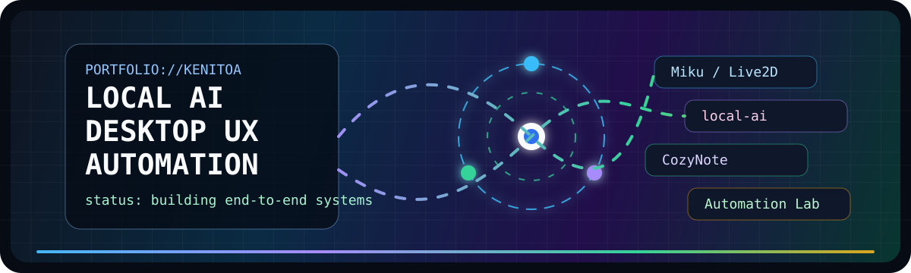
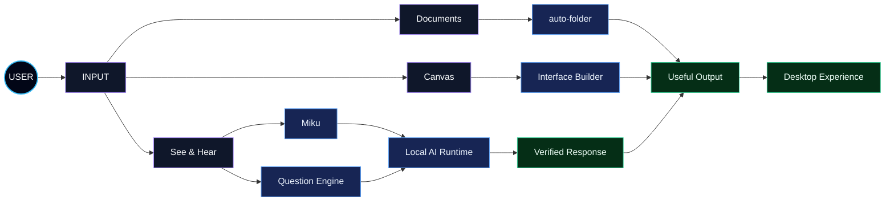
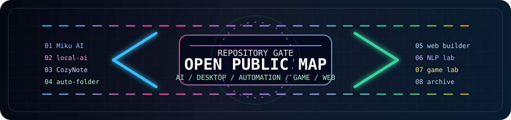

  

<h1 align="center">아이디어를 실제로 쓰는 시스템까지.</h1>

  <strong>Local AI · Desktop Experience · Automation · Experimental Interfaces</strong> 
  모델 호출에서 멈추지 않고, 입력·판단·기억·음성·화면·실행까지 연결하는 개인 개발 포트폴리오입니다.

  
  

  
  
  
  
  
  

---

<table>
  <tr>
    <td width="58%" valign="top">
      <h2>What I build</h2>
      

        저는 <strong>PC 안에서 스스로 동작하는 AI</strong>, 사람이 바로 실행할 수 있는
        <strong>데스크톱 도구</strong>, 반복 작업을 제품으로 바꾸는
        <strong>자동화 시스템</strong>을 만듭니다.
      

      

        각 저장소는 단순한 코드 샘플보다 <code>입력 → 처리 → 검증 → 사용자 경험</code>의
        전체 흐름을 갖추는 데 초점을 둡니다.
      

    </td>
    <td width="42%" valign="top">
      <h2>Build signature</h2>
      <pre>LOCAL-FIRST   keep data close
SYSTEM-MINDED connect the pipeline
USER-READY    one clear entrypoint
VERIFIABLE    prove the real flow</pre>
    </td>
  </tr>
</table>

## Featured Systems

<table>
  <tr>
    <td width="50%" valign="top">
      <h3>01 · <a href="https://github.com/kenitoa/Miku">Miku Virtual AI</a> NEW</h3>
      
<strong>보고, 듣고, 기억하고, 말하며 움직이는 로컬 버추얼 AI 런타임</strong>

      
카메라·마이크부터 STT, RAG, 로컬 LLM, TTS, Live2D 반응까지 책임 영역을 분리해 하나의 실시간 대화 파이프라인으로 연결했습니다.

      
<code>Live2D</code> <code>Electron</code> <code>FunASR</code> <code>Ollama</code> <code>RAG</code> <code>GPT-SoVITS</code>

      <pre>SEE + HEAR → THINK → SPEAK + MOVE</pre>
      <a href="https://github.com/kenitoa/Miku"><strong>시스템 살펴보기 →</strong></a>
    </td>
    <td width="50%" valign="top">
      <h3>02 · <a href="https://github.com/kenitoa/local-ai">local-ai</a></h3>
      
<strong>여러 AI expert를 하나의 Windows 앱으로 다루는 로컬 AI 플랫폼</strong>

      
Router, Executor, Aggregator, Judge 구조로 Ollama·.NET·ONNX 모델을 공통 Expert 규격 아래 조합하고 검증합니다.

      
<code>C#</code> <code>ASP.NET</code> <code>WPF</code> <code>WebView2</code> <code>Ollama</code> <code>ONNX</code>

      <pre>REQUEST → ROUTE → EXPERTS → JUDGE</pre>
      <a href="https://github.com/kenitoa/local-ai"><strong>아키텍처 살펴보기 →</strong></a>
    </td>
  </tr>
  <tr>
    <td width="50%" valign="top">
      <h3>03 · <a href="https://github.com/kenitoa/CozyNote">CozyNote</a></h3>
      
<strong>기록과 보상을 결합한 블록형 데스크톱 메모 앱</strong>

      
JavaFX 블록 에디터, 800ms 지연 자동 저장, SQLite, 검색·필터, 체크리스트 포인트와 음악/꾸미기 위젯을 한 화면에 담았습니다.

      
<code>Java 21</code> <code>JavaFX</code> <code>Gradle</code> <code>SQLite</code>

      <pre>WRITE → AUTO SAVE → COMPLETE → REWARD</pre>
      <a href="https://github.com/kenitoa/CozyNote"><strong>앱 살펴보기 →</strong></a>
    </td>
    <td width="50%" valign="top">
      <h3>04 · <a href="https://github.com/kenitoa/automade-web-site">Interface Auto Builder</a></h3>
      
<strong>드래그로 조립하고 실행 가능한 웹사이트로 저장하는 비주얼 빌더</strong>

      
폼·테이블·차트·탭 같은 기능 블록을 캔버스에 배치하고, 실제 동작을 미리 본 뒤 독립 실행 폴더로 내보냅니다.

      
<code>Visual Builder</code> <code>Drag & Drop</code> <code>Live Preview</code> <code>Export</code>

      <pre>COMPOSE → PREVIEW → EXPORT → RUN</pre>
      <a href="https://github.com/kenitoa/automade-web-site"><strong>빌더 살펴보기 →</strong></a>
    </td>
  </tr>
  <tr>
    <td width="50%" valign="top">
      <h3>05 · <a href="https://github.com/kenitoa/auto-folder">auto-folder</a></h3>
      
<strong>문서의 구조를 읽어 실제 폴더 트리로 만드는 Windows 자동화</strong>

      
Markdown, TXT, DOCX, HWPX의 명시적 트리나 제목 계층을 해석합니다. dry-run과 경로 안전성 검증을 거친 뒤 폴더를 생성합니다.

      
<code>PowerShell</code> <code>DOCX XML</code> <code>HWPX XML</code> <code>Safe Paths</code>

      <pre>DOCUMENT → PARSE → VALIDATE → FOLDERS</pre>
      <a href="https://github.com/kenitoa/auto-folder"><strong>자동화 살펴보기 →</strong></a>
    </td>
    <td width="50%" valign="top">
      <h3>06 · <a href="https://github.com/kenitoa/text-to-make-question">Text To Make Question</a></h3>
      
<strong>한국어 발화의 핵심어를 찾아 자연스러운 후속 질문으로 바꾸는 엔진</strong>

      
외부 형태소 분석기 없이 SQLite 규칙, 관측 데이터, 후보 승격 흐름을 사용하며 CLI와 STT 이벤트를 함께 처리합니다.

      
<code>Python</code> <code>SQLite Rules</code> <code>Korean NLP</code> <code>STT Bridge</code>

      <pre>UTTERANCE → KEYWORD → INTENT → QUESTION</pre>
      <a href="https://github.com/kenitoa/text-to-make-question"><strong>엔진 살펴보기 →</strong></a>
    </td>
  </tr>
</table>

## System Map

프로젝트는 서로 달라도, 제가 해결하는 문제는 하나의 흐름으로 이어집니다.

```mermaid
flowchart LR
    U((USER)) --> I[INPUT]

    I --> S[See & Hear]
    I --> D[Documents]
    I --> C[Canvas]

    S --> M[Miku]
    S --> Q[Question Engine]
    D --> F[auto-folder]
    C --> W[Interface Builder]

    M --> A[Local AI Runtime]
    Q --> A
    A --> X[Verified Response]

    F --> O[Useful Output]
    W --> O
    X --> O

    O --> E[Desktop Experience]

    classDef user fill:#020617,stroke:#38bdf8,color:#f8fafc,stroke-width:2px;
    classDef input fill:#0f172a,stroke:#a78bfa,color:#f8fafc;
    classDef system fill:#172554,stroke:#60a5fa,color:#eff6ff;
    classDef output fill:#052e16,stroke:#34d399,color:#ecfdf5;
    class U user;
    class I,S,D,C input;
    class M,Q,F,W,A system;
    class X,O,E output;
```

## Interface Gallery

<table>
  <tr>
    <td width="50%" align="center" valign="top">
      
       <strong>CozyNote</strong> — block editor, local persistence and reward loop
    </td>
    <td width="50%" align="center" valign="top">
      
       <strong>Interface Auto Builder</strong> — compose, preview and export
    </td>
  </tr>
</table>

## Engineering Principles

<table>
  <tr>
    <td align="center" width="25%"><strong>LOCAL FIRST</strong> 개인 데이터와 모델을 가능한 한 PC 안에</td>
    <td align="center" width="25%"><strong>ONE ENTRYPOINT</strong> 복잡한 내부 구조를 한 번의 실행 뒤에</td>
    <td align="center" width="25%"><strong>BOUNDED SYSTEMS</strong> 입력·판단·출력의 책임을 분리해 연결</td>
    <td align="center" width="25%"><strong>PROOF OVER CLAIMS</strong> 실제 흐름과 실패 경로까지 검증</td>
  </tr>
</table>

## Project Index

  
<strong>AI & interaction</strong> — 펼쳐서 저장소 보기

   
  <table>
    <tr><td><a href="https://github.com/kenitoa/Miku"><strong>Miku</strong></a></td><td>Live2D 기반 로컬 버추얼 AI 동반자</td></tr>
    <tr><td><a href="https://github.com/kenitoa/local-ai"><strong>local-ai</strong></a></td><td>여러 AI expert를 조합하는 Windows 로컬 AI 런타임</td></tr>
    <tr><td><a href="https://github.com/kenitoa/text-to-make-question"><strong>text-to-make-question</strong></a></td><td>한국어 발화를 질문으로 전환하는 규칙 기반 엔진</td></tr>
  </table>

  
<strong>Desktop & automation</strong> — 펼쳐서 저장소 보기

   
  <table>
    <tr><td><a href="https://github.com/kenitoa/CozyNote"><strong>CozyNote</strong></a></td><td>JavaFX 블록 메모장과 로컬 보상 루프</td></tr>
    <tr><td><a href="https://github.com/kenitoa/auto-folder"><strong>auto-folder</strong></a></td><td>문서 구조를 Windows 폴더 트리로 변환</td></tr>
    <tr><td><a href="https://github.com/kenitoa/automade-web-site"><strong>automade-web-site</strong></a></td><td>드래그 앤 드롭 웹 인터페이스 생성기</td></tr>
    <tr><td><a href="https://github.com/kenitoa/PC-search-all-file"><strong>PC-search-all-file</strong></a></td><td>PC 파일 탐색 실험</td></tr>
  </table>

  
<strong>Game, web & archive lab</strong> — 펼쳐서 저장소 보기

   
  <table>
    <tr><td><a href="https://github.com/kenitoa/MuWorld"><strong>MuWorld</strong></a></td><td>C# 기반 리듬 게임 프로젝트</td></tr>
    <tr><td><a href="https://github.com/kenitoa/War-Achive"><strong>War-Achive</strong></a></td><td>전쟁 기록 아카이브 웹 프로젝트</td></tr>
    <tr><td><a href="https://github.com/kenitoa/-3D-"><strong>-3D-</strong></a></td><td>건물·층별 정보를 탐색하는 3D 웹 실험</td></tr>
    <tr><td><a href="https://github.com/kenitoa/data-archive"><strong>data-archive</strong></a></td><td>공개 웹 데이터 아카이브</td></tr>
    <tr><td><a href="https://github.com/kenitoa/mini-project"><strong>mini-project</strong></a></td><td>Python 로직과 알고리즘 실험 모음</td></tr>
  </table>

 

  

  <strong>Explore the systems. Follow the experiments. Watch them become products.</strong> 
  이 README 자체도 GitHub Markdown, HTML, Mermaid, 자체 제작 animated SVG를 조합한 포트폴리오 인터페이스입니다.

