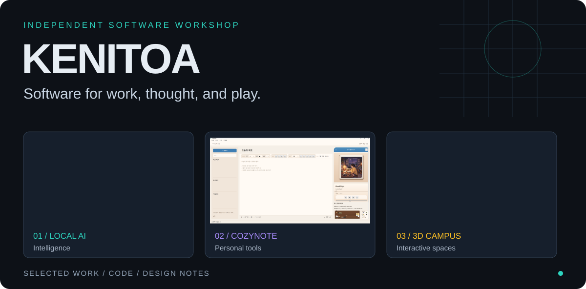
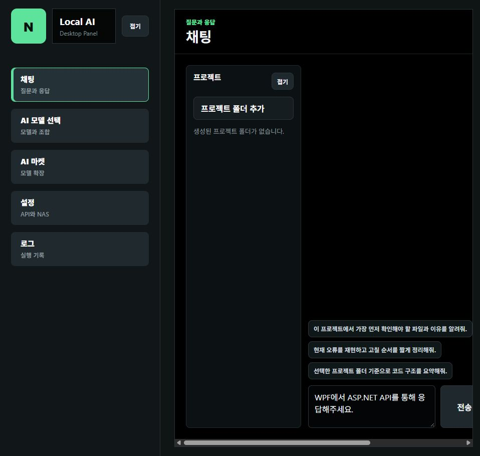
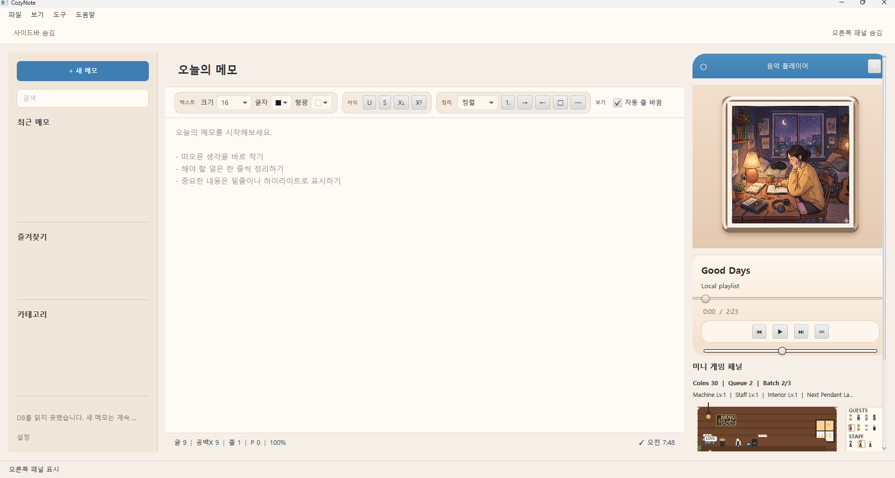
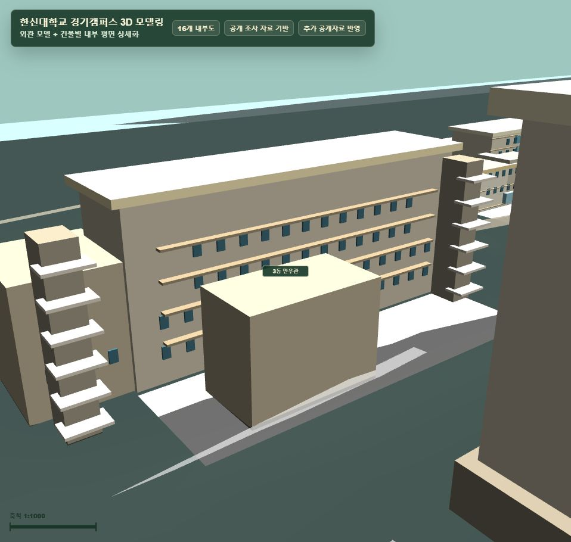
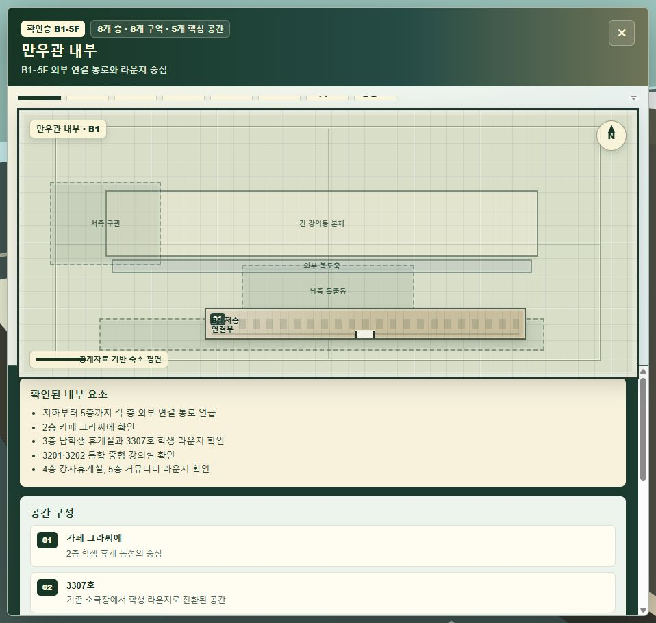

# KENITOA

**상상한 것을 직접 사용할 수 있는 소프트웨어로 만듭니다.**

로컬 AI부터 개인 작업 도구, 게임과 공간 탐색까지. 
정보를 다루고, 작업하고, 새로운 경험을 만나는 방식을 실험합니다.

[대표 프로젝트](#selected-work) · [전체 프로젝트](#explore-my-projects) · [개발 기록](https://kiseno3231.tistory.com) · [GitHub](https://github.com/kenitoa?tab=repositories)

복잡한 실행 과정을 다루기 쉬운 화면으로 정리하고, 반복되는 작업을 도구로 만들며, 정보와 공간을 탐색하는 경험을 구현합니다. 아래에서는 대표작의 화면과 사용 흐름을 먼저 보고, 관심 있는 프로젝트의 코드와 설계 기록으로 이동할 수 있습니다.

---

## Selected Work

**실행을 연결하는 AI · 생각을 담는 도구 · 공간을 읽는 인터페이스**

### 01 / Local AI

**로컬 모델을 하나의 사용 경험으로.**

모델 경로와 실행 명령을 일일이 다루는 부담을 줄이고, 모델 선택·채팅·AI 마켓·로그 확인을 Windows 데스크톱 인터페이스에 모았습니다.

- **사용 흐름:** 실행 도구 시작 → 모델 선택 → 대화 → 실행 상태와 로그 확인.
- **설계 선택:** 웹 UI를 WPF의 WebView2에 표시하고, ASP.NET API를 통해 실행 계층과 연결합니다.
- **현재 범위:** 공개 문서 기준 Ollama adapter, 공통 Expert 구조, 규칙 기반 라우팅, Single/Pipeline 실행 기반을 갖춘 MVP입니다.
- **다음 과제:** 병렬 실행, Judge 품질 평가, fallback 고도화는 확장 영역으로 구분합니다.

`C#` `ASP.NET` `WPF / WebView2` `Ollama`

[코드 보기](https://github.com/kenitoa/local-ai) · [실행 방법](https://github.com/kenitoa/local-ai#빠른-실행) · [설계 기록](https://github.com/kenitoa/local-ai#핵심-원리)

화면은 공개 UI 소스의 초기 상태입니다. 실제 모델 추론이나 데스크톱 통합 실행을 증명하는 시연은 아닙니다.

### 02 / CozyNote

**생각을 적고 다시 찾아보는 개인 작업공간.**

메모를 블록 단위로 구성하고 로컬에 보관하는 데스크톱 노트 앱입니다. 작성·정리·검색 흐름과 저장 상태를 한 화면에서 다룹니다.

- **사용 흐름:** 메모 생성 → 제목과 블록 편집 → 자동 저장 → 검색과 필터로 다시 찾기.
- **설계 선택:** JavaFX로 편집 화면을 구성하고 SQLite에 메모와 설정을 저장합니다. 블록은 메모의 JSON 필드로 관리합니다.
- **현재 범위:** 공개 문서에 블록 편집, 입력 후 자동 저장, 저장 상태 표시, 검색·필터와 체크리스트 보상이 기록되어 있습니다.
- **화면과 기능:** 음악·방 꾸미기 위젯 UI의 존재를 전체 재생·게임 기능의 검증 완료로 해석하지 않습니다.

`Java` `JavaFX` `SQLite` `Gradle`

[코드 보기](https://github.com/kenitoa/CozyNote) · [실행 방법](https://github.com/kenitoa/CozyNote#실행) · [데이터 모델](https://github.com/kenitoa/CozyNote#데이터-모델)

저장소에 게시된 이미지를 사용했습니다. 이번 프로필 개편에서 앱 실행과 저장·복원 동작을 별도로 검증한 것은 아닙니다.

### 03 / 3D Campus

**공간을 둘러보며 정보를 찾는 캠퍼스 지도.**

흩어진 캠퍼스 건물·지형·층별 자료를 브라우저에서 탐색할 수 있는 공간 인터페이스로 구성합니다.

- **사용 흐름:** 캠퍼스 이동 → 건물 선택 → 층별 정보와 조사 근거 확인.
- **설계 선택:** Babylon.js 정적 페이지에 3D 장면과 상세 패널을 결합합니다.
- **현재 범위:** 공개 자료를 바탕으로 구성한 건물과 지형, 내부 기능 정보입니다. 정밀 측량 모델이나 공식 실내 도면과 동일하다는 의미는 아닙니다.
- **정보의 확실성:** 확인된 자료와 공개 근거 기반 추정 영역을 구분합니다.

`JavaScript` `Babylon.js` `Static Web`

건물을 선택한 뒤의 층별 상세 화면

[코드 보기](https://github.com/kenitoa/-3D-) · [실행 방법](https://github.com/kenitoa/-3D-#실행-방법) · [조사 근거](https://github.com/kenitoa/-3D-/blob/main/search.md)

---

## Explore My Projects

관심 있는 분야에서 시작하세요. 아래 분류는 탐색을 위한 묶음이며, 저장소 간 실행 의존 관계를 의미하지 않습니다.

### AI & Language

- [**local-ai**](https://github.com/kenitoa/local-ai) — Windows 로컬 AI 채팅과 모델 실행을 묶는 데스크톱 시스템.
- [**text-to-make-question**](https://github.com/kenitoa/text-to-make-question) — 한국어 발화의 핵심어를 찾아 후속 질문으로 변환하는 규칙 기반 Python 도구.

### Personal Tools

- [**CozyNote**](https://github.com/kenitoa/CozyNote) — 블록형 메모와 로컬 저장을 결합한 작업공간.
- [**auto-folder**](https://github.com/kenitoa/auto-folder) — 문서의 제목과 트리 구조를 폴더 구조로 변환하는 도구.
- [**PC-search-all-file**](https://github.com/kenitoa/PC-search-all-file) — 드라이브 확인, 색인 생성, 파일 이름·경로 검색을 분리한 도구.

### Creation & Play

- [**automade-web-site**](https://github.com/kenitoa/automade-web-site) — 화면 구성 요소를 배치하고 웹사이트를 만드는 제작 도구.
- [**MuWorld**](https://github.com/kenitoa/MuWorld) — 음악과 플레이 경험을 다루는 리듬게임 프로젝트.
- [**3D Campus / -3D-**](https://github.com/kenitoa/-3D-) — 캠퍼스 지형·건물·층별 정보를 탐색하는 브라우저 인터페이스.

### Knowledge & Archives

- [**War-Achive**](https://github.com/kenitoa/War-Achive) — 역사적 정보와 구전을 JSON 양식으로 모으는 전쟁사 아카이브 프로젝트.
- [**warsachive**](https://github.com/kenitoa/warsachive) — 공개 JSON 기록을 정적 페이지로 발행하는 아카이브 프런트엔드.

### Small Experiments

- [**mini-project**](https://github.com/kenitoa/mini-project) — 알고리즘과 작은 로직 구현을 모은 실험장.
- [**kenitoa**](https://github.com/kenitoa/kenitoa) — 프로젝트와 개발 기록을 연결하는 현재 프로필.

---

## How I Build

**사용자에게는 이해할 수 있는 흐름을, 구현에는 확인할 수 있는 근거를 남깁니다.**

| 설계 질문 | 프로젝트에서의 선택 |
| --- | --- |
| 복잡한 실행을 어떻게 다루기 쉽게 만들까? | Local AI에서 화면·API·모델 실행 계층을 나누고, 실행 로그로 상태를 확인합니다. |
| 작성 중인 생각을 어떻게 보관할까? | CozyNote에서 블록 편집과 SQLite 저장을 연결하고 저장 상태를 보여줍니다. |
| 시각화의 근거를 어떻게 전달할까? | 3D Campus에서 조사 자료와 추정 범위를 구분해 공간 정보의 확실성을 설명합니다. |

<strong>설계 기록 더 읽기</strong>

- [Local AI — UI와 실행 런타임의 책임](https://github.com/kenitoa/local-ai#폴더-설명): 화면을 수정하는 위치와 모델을 실행하는 위치를 구분합니다.
- [CozyNote — 데이터 모델과 저장 구조](https://github.com/kenitoa/CozyNote#데이터-모델): 메모와 블록을 어떻게 표현하고 보관하는지 기록합니다.
- [3D Campus — 조사 자료](https://github.com/kenitoa/-3D-/blob/main/search.md): 장면을 구성하는 정보의 근거를 남깁니다.
- [프로필 자료 출처와 확인 범위](docs/profile-evidence.md): 공개 문서, 이미지 출처, 실행 검증 범위를 구분합니다.

## Tools in Practice

사용한 기술을 실제 프로젝트의 역할과 연결합니다. 숙련도 점수 대신 코드와 문서를 통해 확인할 수 있도록 구성했습니다.

| 기술 | 사용한 곳 | 역할 |
| --- | --- | --- |
| C# · ASP.NET · WPF | Local AI | 데스크톱 화면과 실행 서비스 연결 |
| Ollama | Local AI | 로컬 모델 실행 |
| Java · JavaFX · Gradle | CozyNote | 블록형 편집 UI와 앱 빌드 |
| SQLite | CozyNote · Text To Make Question | 메모 저장과 한국어 규칙 데이터 관리 |
| JavaScript · Babylon.js | 3D Campus | 브라우저 3D 장면과 공간 탐색 |
| Python | PC Search · Text To Make Question | 파일 색인과 언어 규칙 처리 |
| PowerShell | Auto Folder | 문서 기반 폴더 생성 작업 |
| Next.js · GitHub Actions | warsachive | 콘텐츠 인덱스와 정적 페이지 발행 |

## Currently Exploring

**2026 기술 방향 — 기존 작업에서 다음 질문으로.**

아래 항목은 프로필 개편과 함께 정리한 **향후 탐구 계획 · Planned** 입니다. 구현 완료나 실험 착수를 뜻하지 않습니다. 실제 실험 기록이 생기면 `Exploring`, 재현 가능한 결과가 있으면 `Implemented`로 갱신합니다.

| 상태 | 주제 | 연결할 작업 · 확인할 결과 |
| --- | --- | --- |
| `Planned` | 로컬 AI 도구 호출 | Local AI에서 도구 실행 범위·실행 결과·실패 상태를 사용자가 이해할 수 있는지 확인 |
| `Planned` | MCP 도구 연결 | 파일 검색과 폴더 생성 미리보기를 AI 환경에서 재사용 가능한 도구로 연결 |
| `Planned` | AI 평가와 실행 기록 | 모델·환경·대표 입력·실패·취소·응답 시간을 함께 기록하는 평가 문서 작성 |
| `Planned` | WebGPU와 브라우저 그래픽 | 3D Campus의 기기별 로딩과 탐색 성능을 측정하고 채택 효과 비교 |

[Ollama Tool Calling](https://docs.ollama.com/capabilities/tool-calling) · [MCP Architecture](https://modelcontextprotocol.io/docs/learn/architecture) · [Babylon.js WebGPU](https://doc.babylonjs.com/setup/support/webGPU/)

2026년에 새로 등장한 기술이라는 의미가 아니라, 현재 프로젝트에 연결해 검토할 기술 방향입니다.

## Recent Updates

아래는 최근 커밋 수를 나열하는 대신, 공개 문서에서 확인한 의미 있는 구현 내용을 고른 기록입니다. 날짜는 기능 출시일이 아닌 **문서 확인일**입니다.

- **2026-09-27 · Local AI** — 데스크톱 UI와 API·Ollama 실행 흐름을 한 실행 진입점으로 정리하고 문제 확인용 로그 위치를 안내합니다. [기록](https://github.com/kenitoa/local-ai#빠른-실행)
- **2026-09-27 · CozyNote** — 블록 편집과 자동 저장 상태를 연결해 작성과 보관 과정을 확인할 수 있도록 구성합니다. [기록](https://github.com/kenitoa/CozyNote#현재-구현-범위)
- **2026-09-27 · 3D Campus** — 건물 탐색과 층별 정보를 연결하고 자료의 확인 범위와 추정을 구분합니다. [기록](https://github.com/kenitoa/-3D-#프로젝트-목적)

공개 저장소 메타데이터 확인

<!-- metadata:start -->
확인일: 2026-09-27 (UTC)

- [local-ai](https://github.com/kenitoa/local-ai) · 저장소 push: 2026-06-02 · 공개 릴리스 없음
- [CozyNote](https://github.com/kenitoa/CozyNote) · 저장소 push: 2026-06-30 · 공개 릴리스 없음
- [-3D-](https://github.com/kenitoa/-3D-) · 저장소 push: 2026-05-11 · 공개 릴리스 없음
<!-- metadata:end -->

날짜·릴리스 링크만 자동 갱신하며 소개와 대표 변화는 직접 편집합니다. 조회가 실패하면 기존 내용을 유지합니다.

---

## Find Me

**코드에서 시작해, 제작 과정까지 살펴보세요.**

[전체 공개 저장소](https://github.com/kenitoa?tab=repositories) · [개발 기록 / Tistory](https://kiseno3231.tistory.com) · [공개 소셜 / X](https://x.com/gimdong42753841)

프로젝트 질문과 재현 가능한 문제 제보는 해당 저장소의 Issues가 열려 있는 경우 그곳에 남겨주세요.

KENITOA · Software for work, thought, and play.
